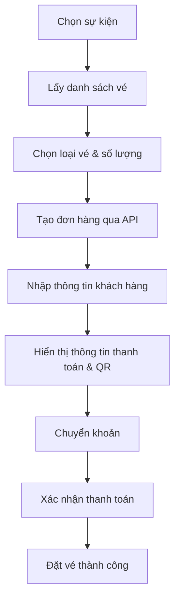

# Flow Mua Vé Sự Kiện (Testflight)

## Tổng quan
Tài liệu này mô tả chi tiết quy trình mua vé trên trang `testflight-buy-ticket/page.tsx`, bao gồm các bước, endpoint API sử dụng, dữ liệu gửi/nhận, và các lưu ý về UX/UI. Tài liệu này dùng để tham khảo khi xây dựng các trang frontend mua vé khác.

---

## 1. Bước 1: Chọn sự kiện và loại vé

### UI/UX
- Hiển thị danh sách sự kiện cho phép chọn (dropdown/select).
- Sau khi chọn sự kiện, hiển thị danh sách các loại vé tương ứng, cho phép nhập số lượng từng loại vé.
- Nút "Checkout" để sang bước tiếp theo.

### API sử dụng
- **Lấy danh sách sự kiện:**
  - `GET /events`
  - **Request:** Không cần tham số
  - **Response:**
    ```json
    [
      {
        "id": "event_id",
        "title": "Tên sự kiện",
        "organization_id": "org_id",
        "organization": { "id": "org_id", "name": "Tên tổ chức", ... }
      }, ...
    ]
    ```
- **Lấy danh sách vé của sự kiện:**
  - `GET /tickets/event/{eventId}`
  - **Request:** `{eventId}` là ID của sự kiện đã chọn
  - **Response:**
    ```json
    [
      {
        "id": "ticket_id",
        "name": "Tên vé",
        "price": 100000,
        "event_id": "event_id"
      }, ...
    ]
    ```

---

## 2. Bước 2: Tạo đơn hàng (Order)

### UI/UX
- Sau khi chọn vé và số lượng, nhấn "Checkout" để tạo đơn hàng.
- Nếu chưa đăng nhập, hiển thị thông báo yêu cầu đăng nhập.
- Nếu chưa chọn vé hoặc sự kiện, hiển thị lỗi.

### API sử dụng
- **Tạo đơn hàng:**
  - `POST /orders`
  - **Headers:**
    - `Authorization: Bearer {access_token}`
    - `Content-Type: application/json`
  - **Body:**
    ```json
    {
      "organization_id": "org_id",
      "event_id": "event_id",
      "items": [
        { "ticket_id": "ticket_id", "quantity": 2 },
        ...
      ]
    }
    ```
  - **Response:**
    ```json
    {
      "id": "order_id",
      "total_amount": 200000,
      "status": "PENDING",
      "created_at": "...",
      "order_items": [
        { "ticket_id": "ticket_id", "quantity": 2, "price": 100000, ... }, ...
      ]
    }
    ```

---

## 3. Bước 3: Nhập thông tin khách hàng

### UI/UX
- Hiển thị form nhập email, họ tên, số điện thoại.
- Kiểm tra bắt buộc email.
- Nút "Tiếp tục thanh toán" để sang bước tiếp theo.
- (Lưu ý: Trong flow này, user đã đăng nhập nên chỉ validate, không tạo user mới.)

---

## 4. Bước 4: Thanh toán & giữ vé

### UI/UX
- Hiển thị thông tin chuyển khoản:
  - Ngân hàng, số tài khoản, nội dung chuyển khoản (order id), số tiền.
  - Hiển thị mã QR chuyển khoản (VietQR).
  - Hiển thị đồng hồ đếm ngược giữ vé (ví dụ: 15 phút).
- Hướng dẫn: chuyển khoản đúng số tiền và nội dung để hệ thống tự động xác nhận.
- Sau khi hết thời gian giữ vé, đơn hàng sẽ bị huỷ tự động.

### QR Code
- Sử dụng dịch vụ VietQR:
  - `https://img.vietqr.io/image/VPB-214244527-compact.png?amount={total_amount}&addInfo=OCX{order_id}&accountName=PHAM NG CAO TRIET`

---

## 5. Bước 5: Xác nhận & hoàn tất

### UI/UX
- Sau khi thanh toán thành công (xác nhận từ backend), hiển thị thông báo đặt vé thành công.
- Vé sẽ được gửi về email của khách hàng.

---

## 6. Xử lý lỗi & UX
- Nếu có lỗi khi gọi API (mạng, backend trả lỗi, ...), hiển thị thông báo lỗi rõ ràng.
- Nếu chưa đăng nhập, yêu cầu đăng nhập trước khi tạo order.
- Nếu hết thời gian giữ vé, thông báo đơn hàng bị huỷ.

---

## 7. Tóm tắt các endpoint API sử dụng
| Hành động                | Endpoint                        | Method |
|--------------------------|----------------------------------|--------|
| Lấy danh sách sự kiện    | `/events`                        | GET    |
| Lấy vé theo sự kiện      | `/tickets/event/{eventId}`       | GET    |
| Tạo đơn hàng             | `/orders`                        | POST   |

---

## 8. Lưu ý mở rộng
- Các bước có thể được tuỳ biến thêm (ví dụ: chọn chỗ ngồi, thêm voucher, ...).
- Cần xác thực token ở mọi API cần bảo mật.
- Có thể bổ sung bước xác nhận thanh toán tự động qua webhook hoặc polling trạng thái order.

---

## 9. Sơ đồ tổng quan flow

